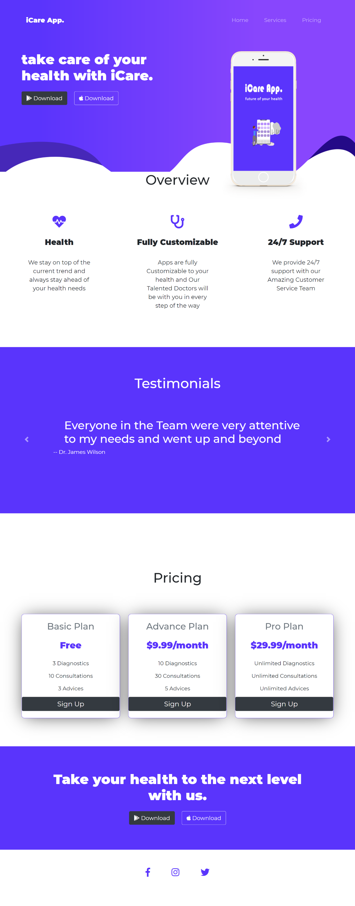

# Landing-page-bootstrap

## Bienvenue! 👋

**Pour dévelpper une page vitrine, vous avez besoin d'une compréhension de base du HTML et du CSS.**

## Où tout trouver?

Votre tâche consiste à construire le projet from scratch.
Mettez vos images utilisés dans :file_folder: `/image`. Vous y trouverez le fichier html sur laquelle travailler.

Voir les maquettes en format PNG dans :file_folder: `/mockup`.

## Preview
### Desktop preview

---
### Mobile preview

